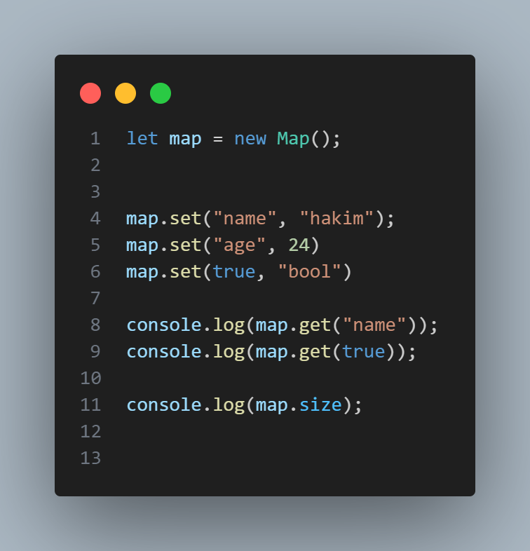
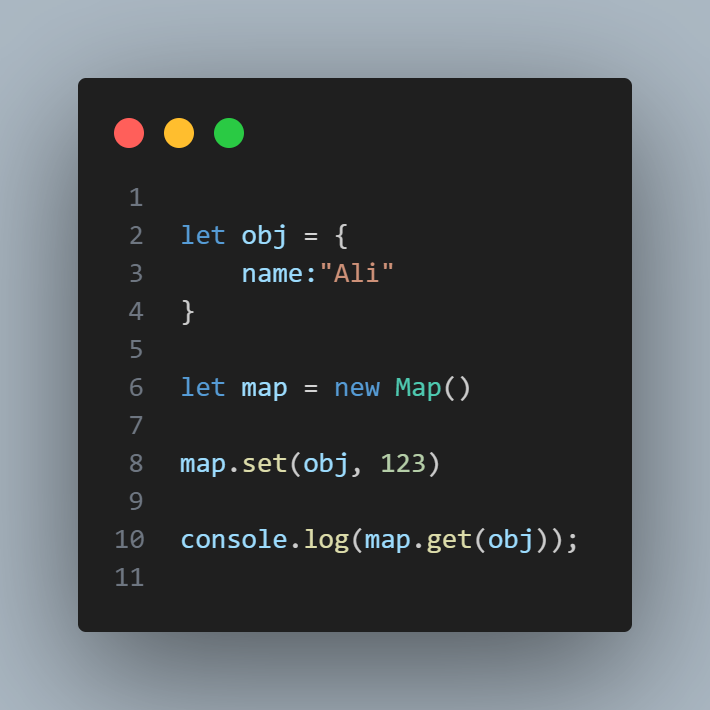
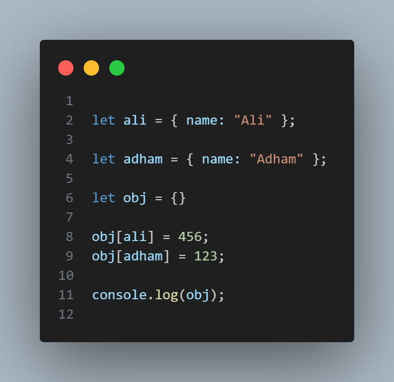
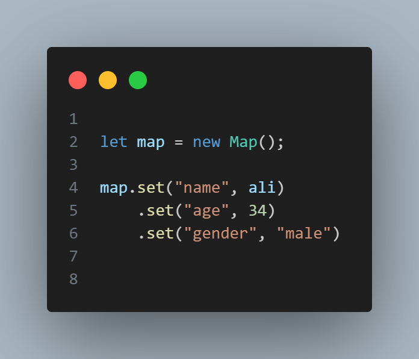
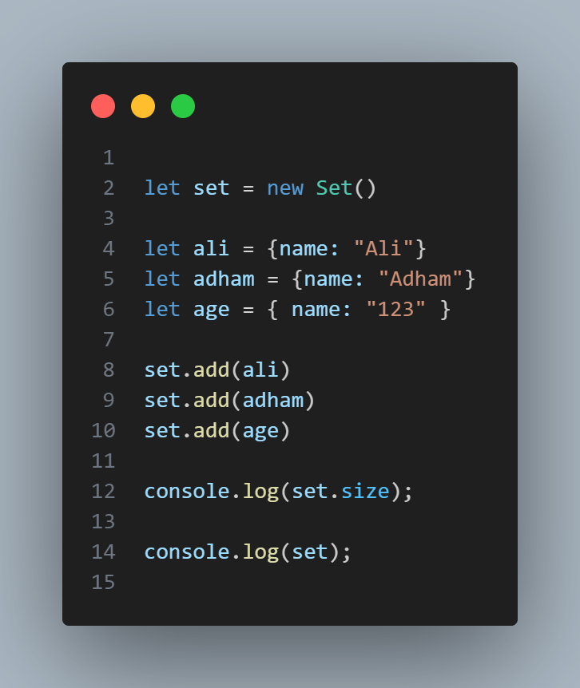

# Map и Set

>

`\*Объекты для хранения именованных коллекций.

\*Массивы для хранения упорядоченных коллекций.`

#### Map

`Map – это коллекция ключ/значение, как и Object. Но основное отличие в том, что Map позволяет использовать ключи любого типа.`

> > Методы и свойства:

`new Map()` – создаёт коллекцию.

`map.set(key, value)` – записывает по ключу key значение value.

`map.get(key)` – возвращает значение по ключу или undefined, если ключ key отсутствует.

`map.has(key)` – возвращает true, если ключ key присутствует в коллекции, иначе false.

`map.delete(key)` – удаляет элемент (пару «ключ/значение») по ключу key.

`map.clear()` – очищает коллекцию от всех элементов.

`map.size` – возвращает текущее количество элементов.

Например:

Как мы видим, в отличие от объектов, ключи не были приведены к строкам. Можно использовать любые типы данных для ключей.

map[key] это не совсем правильный способ использования Map
Хотя map[key] также работает, например, мы можем установить map[key] = 2, в этом случаеmap рассматривался бы как обычный JavaScript объект, таким образом это ведёт ко всем соответствующим ограничениям (только строки/символьные ключи и так далее).

Поэтому нам следует использовать методы map: set, get и так далее.

Map может использовать объекты в качестве ключей.

Например:

Использование объектов в качестве ключей – одна из наиболее заметных и важных функций Map. Это то что невозможно для Object. Строка в качестве ключа в Object – это нормально, но мы не можем использовать другой Object в качестве ключа в Object.

Давайте попробуем заменить Map на Object:

Так как visitsCountObj является объектом, он преобразует все ключи Object, такие как john и ben, в одну и ту же строку "[object Object]". Это определенно не то, чего мы хотим.

Как объект Map сравнивает ключи
Чтобы сравнивать ключи, объект Map использует алгоритм SameValueZero. Это почти такое же сравнение, что и ===, с той лишь разницей, что NaN считается равным NaN. Так что NaN также может использоваться в качестве ключа.

Этот алгоритм не может быть заменён или модифицирован.

Цепочка вызовов
Каждый вызов map.set возвращает объект map, так что мы можем объединить вызовы в цепочку:

Перебор Map
Для перебора коллекции Map есть 3 метода:

`map.keys()` – возвращает итерируемый объект по ключам,

`map.values()` – возвращает итерируемый объект по значениям,

`map.entries()` – возвращает итерируемый объект по парам вида [ключ, значение], этот вариант используется по умолчанию в for..of.

# Set

> Объект Set – это особый вид коллекции: «множество» значений (без ключей), где каждое значение может появляться только один раз.

Его основные методы это:

`new Set(iterable)` – создаёт `Set`, и если в качестве аргумента был предоставлен итерируемый объект (обычно это массив), то копирует его значения в новый `Set`.

`set.add(value)` – добавляет значение (если оно уже есть, то ничего не делает), возвращает тот же объект `set`.

`set.delete(value)` – удаляет значение, возвращает true, если value было в множестве на момент вызова, иначе false.

`set.has(value)` – возвращает true, если значение присутствует в множестве, иначе false.

`set.clear()` – удаляет все имеющиеся значения.

`set.size` – возвращает количество элементов в множестве.
Основная «изюминка» – это то, что при повторных вызовах `set.add()`с одним и тем же значением ничего не происходит, за счёт этого как раз и получается, что каждое значение появляется один раз.

Например, мы ожидаем посетителей, и нам необходимо составить их список. Но повторные визиты не должны приводить к дубликатам. Каждый посетитель должен появиться в списке только один раз.

Множество `Set`– как раз то, что нужно для этого:

Set имеет те же встроенные методы, что и Map:

`set.keys()` – возвращает перебираемый объект для значений,

`set.values()` – то же самое, что и `set.keys()`, присутствует для обратной совместимости с Map,

`set.entries()` – возвращает перебираемый объект для пар вида [значение, значение], присутствует для обратной совместимости с Map.